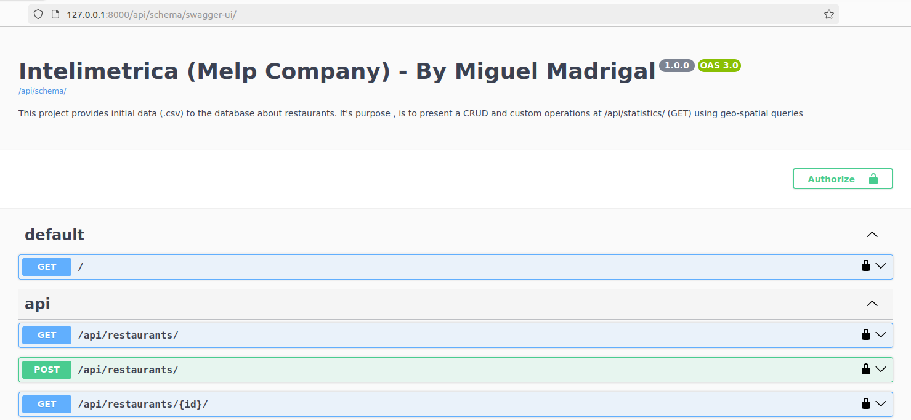

<h1 align="center">Intelimetrica (Melp company) test</h1>

<h3 align="center">This project covers:</h3>

- 🌱 Importing .csv data and performing REST API CRUD operations with restaurants.

- 👨‍💻 Custom endpoint implementation to calculate restaurants inside a circle, as well as average & standard derivation around the rating.

- 💪 Dockerization & Deployment and API Documentation using Swagger

<h3 align="center">aaa</h3>

## Author

- [Miguel Arturo Madrigal Escoto](https://github.com/Miguel-Arturo-Madrigal-Escoto/)