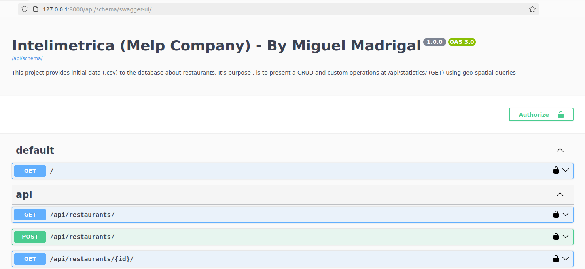

<h1 align="center">Intelimetrica (Melp company) test</h1>

<h3 align="center">This project covers:</h3>


- 🌱 Importing .csv data to perform REST API CRUD operations with restaurants.

- 👨‍💻 Custom endpoint implementation to calculate restaurants inside a circle, as well as average & standard derivation around the rating.

- 💪 Dockerization & Deployment to Railway.

- 🍀 Documentation using Swagger.

<h3 align="center">The core technologies used in this application: </h3>


- 🐍 <b>Programming: </b> Python + Django REST Framework

- 🛢 <b>Database (SQL): </b> PostgreSQL

- 🐼 <b>Data management: </b> Pandas

- 🌎 <b>Spatial Queries: </b> GeoDjango with PostGIS

- 🐧 <b>OS: </b> GNU/Linux (Ubuntu)

- 🐳 <b>Container: </b> Docker

- ☁️ <b>Cloud: </b> Railway

- 📗 <b>Documentation: </b> Swagger

<br>

To run the project you need:
```
git clone https://github.com/Miguel-Arturo-Madrigal-Escoto/RESTFul-API---Melp
```

Create a virtual environment:
```
python3 -m venv env
```

After that, access the virtual environment
```
venv source env/bin/activate
```

Then, install the dependencies
```
pip3 install -r requirements.txt
```

Install the modules to enable GeoDjango for the spatial operations (PostGis & Gdal):
```
sudo apt-get install postgis*
sudo apt-get install binutils libproj-dev gdal-bin
```

Fill the .env.example variables with your postgres database credentials and rename it to .env:
```
ENV='local'
PGHOST='localhost'
PGDATABASE='example-db'
PGPORT='1234'
PGUSER='example-user'
PGPASSWORD='*********'
SECRET_KEY='*************'
ALLOWED_HOSTS='127.0.0.1|localhost:8000'
```

Run the migrations to create the database structure (make sure you have already created a postgres db)
```
python3 manage.py migrate
```

Seed the database with the .csv data using the command:
```
python3 manage.py seed
```

Run the application using the command:
```
python3 manage.py runserver
```


<h4>
    By accessing the route "api/schema/swagger-ui/" you will have documentation to use the REST API.
</h4>
<p align="center">
    
</p>


## Author

- [Miguel Arturo Madrigal Escoto](https://github.com/Miguel-Arturo-Madrigal-Escoto/)